## TerrainFusion: Real-time Digital Surface Model Reconstruction based on Monocular SLAM.

TerrainFuison pdf : https://github.com/shaxikai/TerrainFusion/blob/master/TerrainFusion.pdf

### TerrainFusion Dataset

Download the dataset from https://pan.baidu.com/s/1j-sv6Id9Kbk3qwfW7bZvqg (password : wn8r) which contains several scenarios, including city, mountains, desert, and plains.  The resolution of the aerial images is 4000×3000. The full resolution results are available by clicking on the thumbnails.

### Results on TerrainFusion Dataset

An evaluation of our system is performed over the [TerrainFusion Dataset](http://XXX.com), where the DSM (top) and orthomosaic (bottom) results are shown in the figures below. The full resolution results are available by clicking on the thumbnails.

<figure>
    <a href="./images/DSMfactory-side.png">
        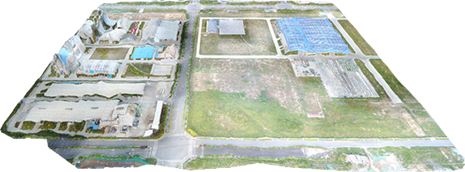</a>
    <a href="./images/DSMvillage-side.png">
        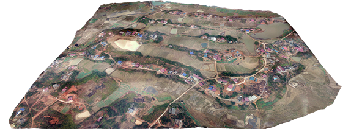</a>
    <a href="./images/DSMmountainlong-side.png">
    	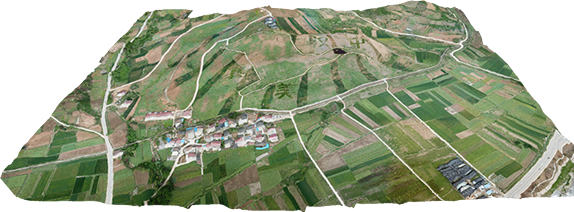</a>
</figure>

<figure>
    <a href="./images/DSMfactory-up.png">
        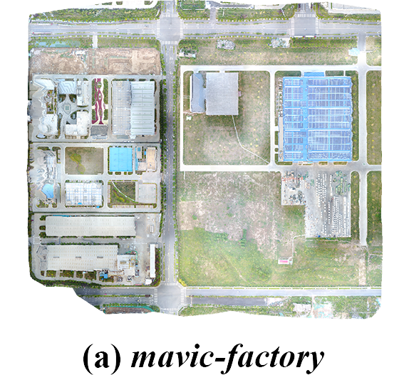</a>
    <a href="./images/DSMvillage-up.png">
    	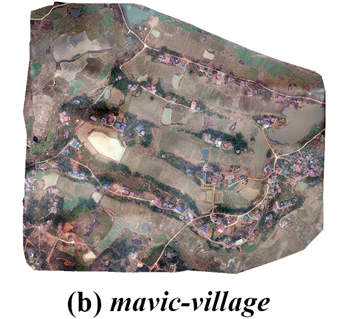</a>
    <a href="./images/DSMmountainlong-up.png">
    	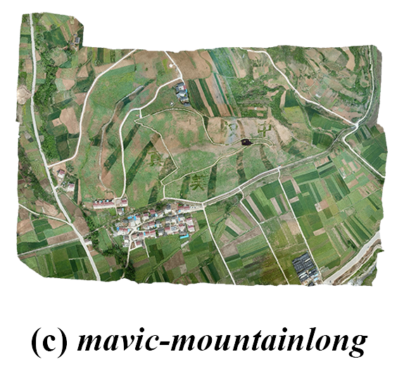</a>
</figure>

<figure class="3">
    <a href="./images/DSMshamo-side.png">
        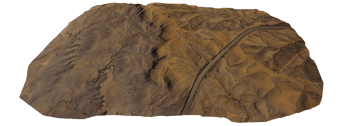</a>
    <a href="./images/DSMfengniao-side.png">
        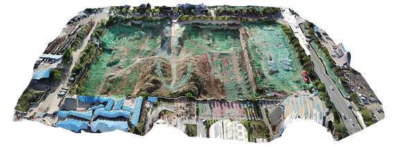</a>
    <a href="./images/DSMmound60-side.png">
        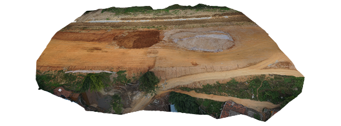</a>
</figure>

<figure>
    <a href="./images/DSMshamo-up.png">
        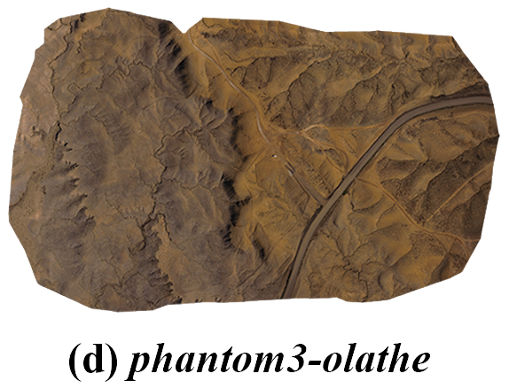</a>
    <a href="./images/DSMfengniao-up.png">
        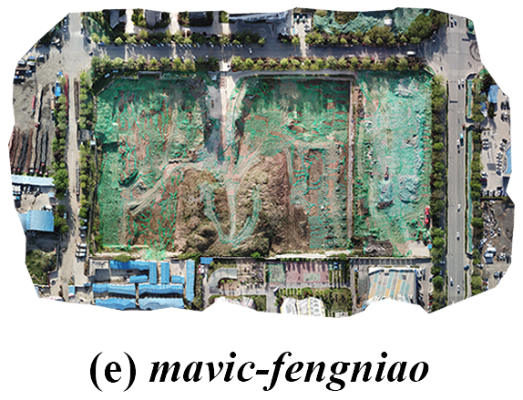</a>
    <a href="./images/DSMmound60s-up.png">
        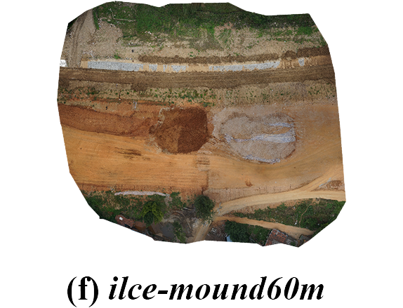</a>
</figure>

### Video

Download the video from https://pan.baidu.com/s/1kh2iMtpRRxrThzy694nu5g (password : nhq8) 

### Application

RTMapper

to be continued.....