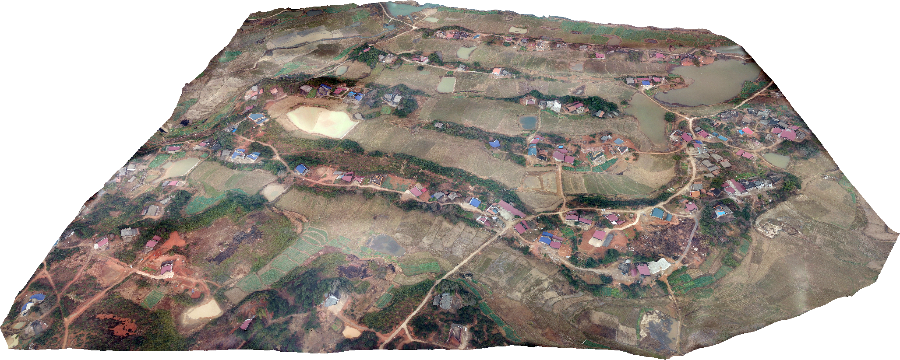
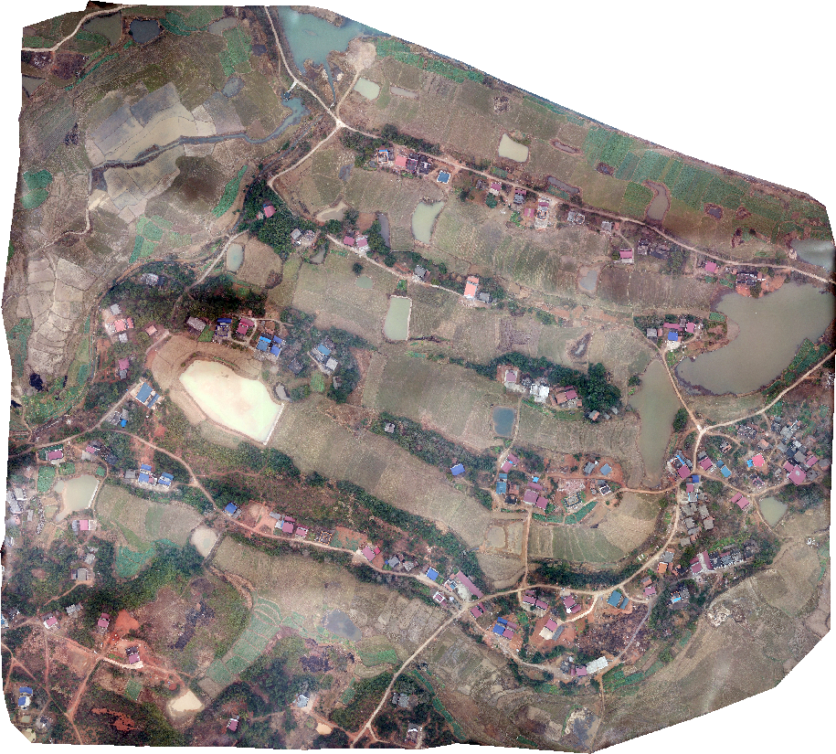

## TerrainFusion: Real-time Digital Surface Model Reconstruction based on Monocular SLAM.

TerrainFuison pdf : https://github.com/shaxikai/TerrainFusion/blob/master/TerrainFusion.pdf

### TerrainFusion Dataset

Download the dataset from http://XXX.com which contains several scenarios, including city, mountains, desert, and plains.  The resolution of the aerial images is 4000×3000. 

### Results on TerrainFusion Dataset

An evaluation of our system is performed over the [TerrainFusion Dataset](http://XXX.com), where the DSM (top) and orthomosaic (bottom) results are shown in the figures below.

<figure class="third">
    
    
    
</figure>

<figure class="third">
    
    
    
</figure>

​                 (a) _mavic-facotry_                                (b) _mavic-village_                               (c) _ilce-mountainlong_      

<figure class="third">
    
    
    
</figure>

<figure class="third">
    
    
    
</figure>

​            (d) _pyantom3-olathe_                             (e) _mavic-fengniao_                          (f) _mavic-mound60m_ 

### Video

TerrainFusion.mp4 

